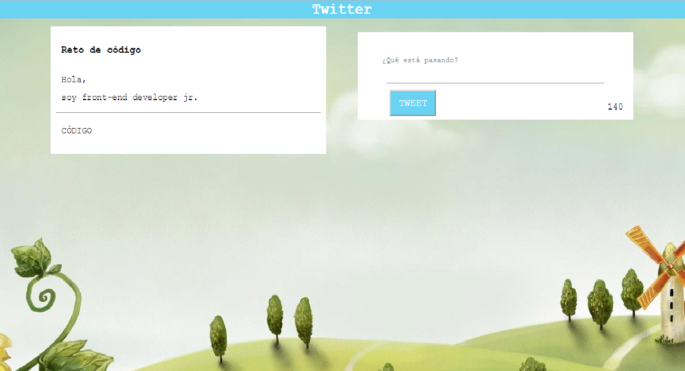

# Twitter

Se muestra en pantalla un cuadro de texto con datos generales.
En un segundo cuadro se hace la interacción para el proceso de twittear, consta de un cuadro para texto, un botón tweet y un contador de cuanto se va escribiendo en este.
Se muestra un tercer cuadro de texto, este será visible una vez se haga click en el botón Twwet.

